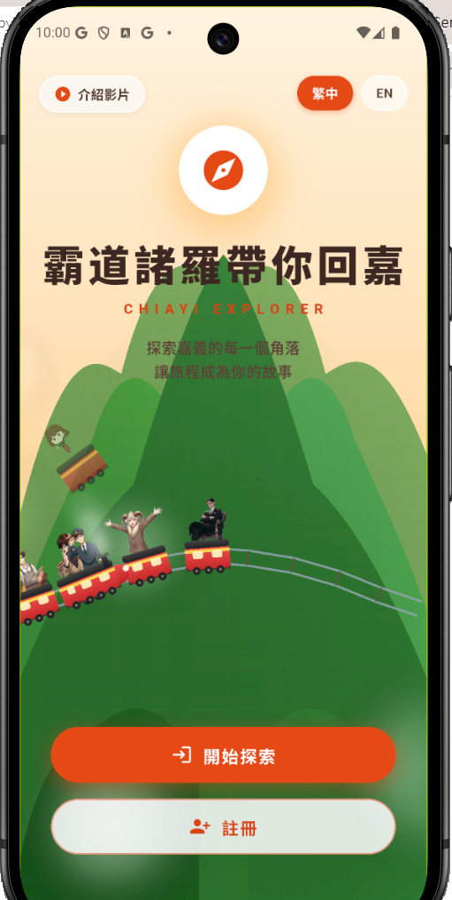
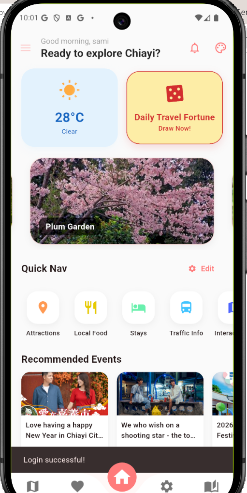
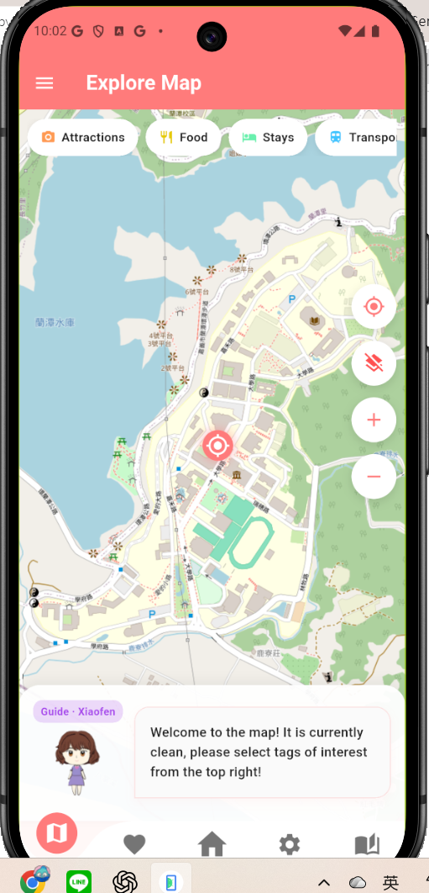
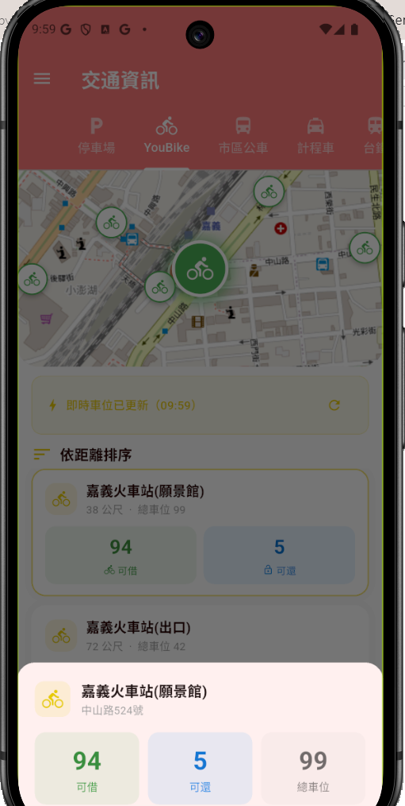
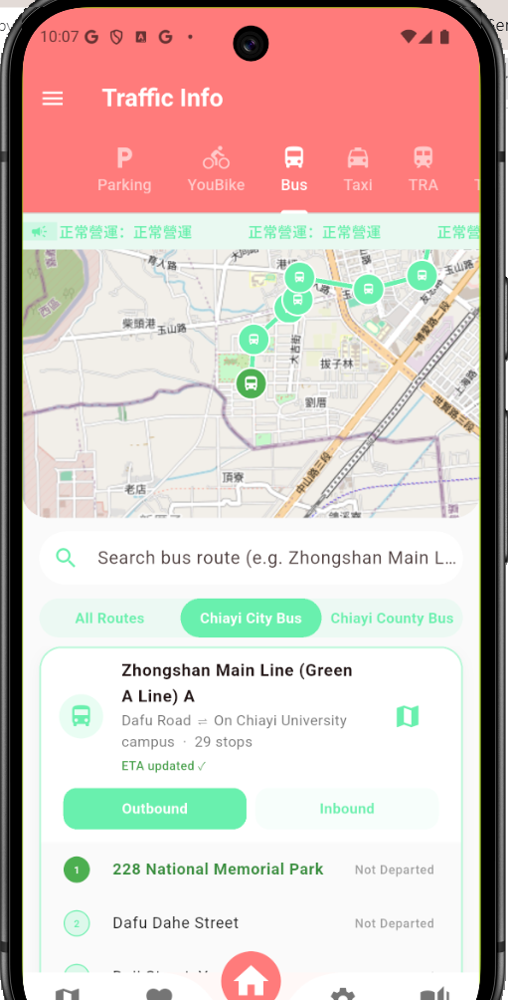
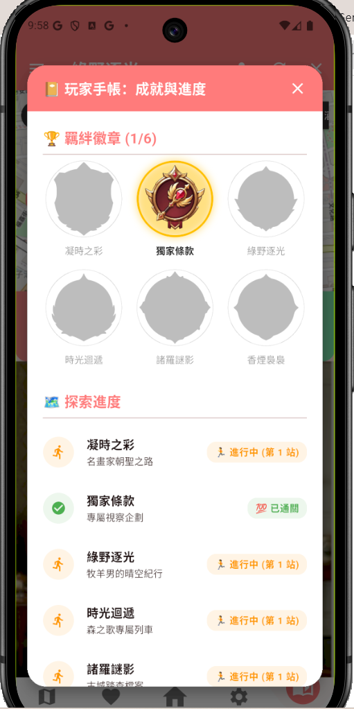

# 探索諸羅

「探索諸羅」是一款以嘉義旅遊為主題的 Flutter 行動 App，整合景點、美食、住宿、交通、活動與互動地圖，讓使用者能在同一個 App 中規劃並體驗嘉義旅程。

## 主要功能

- 即時首頁資訊：個人化問候、天氣狀態、每日旅遊運勢及近期活動
- 嘉義旅遊探索：查找景點、在地美食、特色住宿與交通資訊
- 互動地圖：依分類查看周邊旅遊資訊、定位與地圖圖層
- 行程與收藏：建立個人旅遊行程並收藏感興趣的地點
- 互動故事模式：透過不同故事路線探索嘉義特色內容
- AI 旅遊助理：提供旅遊問題回答與行程建議
- 個人化設定：支援暱稱、頭像、主題配色及中英文介面
- 雲端同步與通知：使用 Firebase 保存使用者資料與接收通知

## App 畫面

### 首頁與雙語介面

<p align="center">
  
  
  
</p>

### 互動地圖與即時交通

<p align="center">
  
  
  
</p>

### 互動故事與成就

<p align="center">
  
  
  
</p>

### AI 旅遊助理與行程管理

<p align="center">
  
  
</p>

## 使用技術

- Flutter / Dart
- Firebase Authentication、Cloud Firestore、Firebase Storage、Firebase Messaging
- OpenStreetMap
- Open-Meteo 即時天氣資料
- Gemini API

## 本機執行

1. 安裝 Flutter SDK，並確認開發環境可正常執行 `flutter doctor`。
2. 安裝套件：

   ```bash
   flutter pub get
   ```

3. 複製環境變數範例並填入自己的 API Key：

   ```bash
   copy .env.example .env
   ```

4. 啟動 App：

   ```bash
   flutter run
   ```

## 安全說明

`.env`、Firebase Admin 私鑰及本機維護腳本不會加入 Git。請勿將 API Key、服務帳戶 JSON 或其他私密憑證提交至儲存庫。
